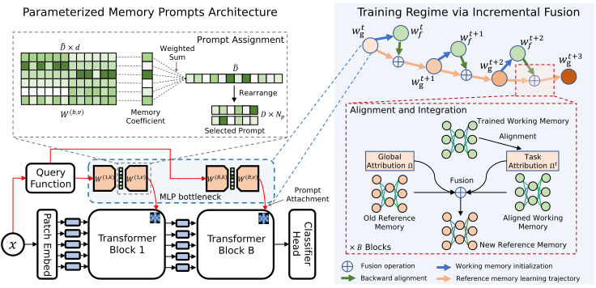

# EvoPrompt

The official PyTorch implementation of our **AAAI 2024 (Oral)** paper:

[Evolving Parameterized Prompt Memory for Continual Learning](https://mrifkikurniawan.github.io/blog/2024/EvoPrompt/)

_Muhammad Rifki Kurniawan, Xiang Song, Zhiheng Ma, Yuhang He, Yihong Gong, Qi Yang, Xing Wei._

GitHub maintainer: [Muhammad Rifki Kurniawan](https://mrifkikurniawan.github.io/)

## Highlight

<div align=center></div>

### :bookmark:Brief Introduction

Recent studies have demonstrated the potency of leveraging prompts in Transformers for continual learning (CL). Nevertheless, employing a discrete key-prompt bottleneck can lead to selection mismatches and inappropriate prompt associations during testing. Furthermore, this approach hinders adaptive prompting due to the lack of _shareability_ among nearly identical instances at more granular level. To address these challenges, we introduce the **Evo**lving Parameterized **Prompt** Memory (EvoPrompt), a novel method involving adaptive and continuous prompting attached to pre-trained Vision Transformer (ViT), conditioned on specific instance. We formulate a continuous prompt function as a neural bottleneck and encode the collection of prompts on network weights. We establish a paired prompt memory system consisting of a **stable reference** and a **flexible working prompt memory**. Inspired by _linear mode connectivity_, we progressively **fuse** the working prompt memory and reference prompt memory during inter-task periods, resulting in **continually evolved prompt memory**. This fusion involves aligning functionally equivalent prompts using optimal transport and aggregating them in parameter space with an adjustable bias based on prompt node attribution. Additionally, to enhance backward compatibility, we propose **compositional classifier initialization**, which leverages prior prototypes from pre-trained models to guide the initialization of new classifiers in a subspace-aware manner.

## Preparing Environment

Create Anaconda environment and installing the dependencies and library (we use CUDA 12.2):

```bash
# conda environment
conda env create -f environment.yml
conda activate cl

# install inclearn library
pip install -e .
```

## Training EvoPrompt

Run the following script to reproduce our experiments on Split CIFAR100, ImageNet-R, and CORe50 on 5, 10, and 20 tasks.

- Split CIFAR100

```bash
# 5 tasks
bash scripts/evoprompt/train-cifar100-5_tasks.sh

# 10 tasks
bash scripts/evoprompt/train-cifar100-10_tasks.sh

# 20 tasks
bash scripts/evoprompt/train-cifar100-20_tasks.sh
```

- Split ImageNet-R

```bash
# 5 tasks
bash scripts/evoprompt/train-imagenetr-5_tasks.sh

# 10 tasks
bash scripts/evoprompt/train-imagenetr-10_tasks.sh

# 20 tasks
bash scripts/evoprompt/train-imagenetr-20_tasks.sh
```

- CORe50

```bash
bash scripts/evoprompt/train-core50.sh
```

You can also reproduce our experiments on following _simple baseline_ using these scripts:

- [FT-LP](scripts/ft-lp)
- [FT-NME](scripts/ft-nme)
- [FT-Seq](scripts/ft-seq)

## Acknowledgement

Our continual trainer is built on top of the following projects and sincerely appreciate great open-source code:

- [incremental_learning.pytorch](https://github.com/arthurdouillard/incremental_learning.pytorch) [[related paper](https://arxiv.org/abs/2004.13513)]
- [otfusion](https://github.com/sidak/otfusion) [[related paper](https://arxiv.org/abs/1910.05653)]

## Citation

If you find our paper or code useful for your research, we'd be thrilled if you could citing our work.

```
@article{kurniawan2024evoprompt,
  title={Evolving Parameterized Prompt Memory for Continual Learning},
  volume={38},
  url={https://ojs.aaai.org/index.php/AAAI/article/view/29231},
  DOI={10.1609/aaai.v38i12.29231},
  number={12},
  journal={Proceedings of the AAAI Conference on Artificial Intelligence},
  author={Kurniawan, Muhammad Rifki and Song, Xiang and Ma, Zhiheng and He, Yuhang and Gong, Yihong and Qi, Yang and Wei, Xing},
  year={2024},
  month={Mar.},
  pages={13301-13309} }
```
